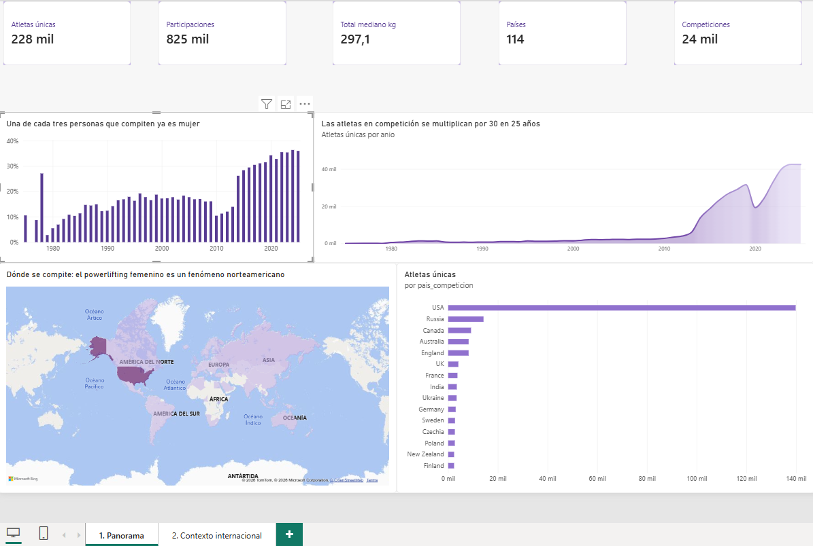
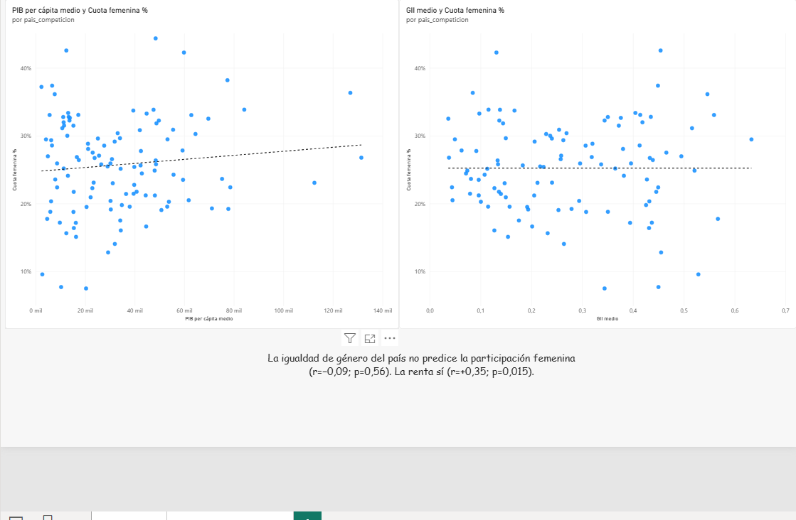

# Powerlifting femenino: rendimiento y contexto social

Proyecto final del Máster en Data Analytics.

Se analizan 825.296 participaciones de 227.570 atletas femeninas en competiciones
de powerlifting de 114 países entre 1975 y 2026, cruzadas con indicadores
socioeconómicos y de igualdad de género del Banco Mundial y del PNUD.

## La pregunta de partida

¿Cómo ha crecido el powerlifting femenino en el mundo, qué determina el
rendimiento de una atleta, y qué papel juega el contexto social de su país?

De ahí salen cuatro preguntas operativas, una por notebook:

1. ¿Cuánto y dónde ha crecido la participación femenina?
   ([notebook 03](notebooks/03_pregunta1_participacion.ipynb))
2. ¿Qué determina el rendimiento?
   ([notebook 04](notebooks/04_pregunta2_rendimiento.ipynb))
3. ¿Influye el contexto social del país?
   ([notebook 05](notebooks/05_pregunta3_contexto_social.ipynb))
4. ¿Se puede predecir la marca de una atleta?
   ([notebook 06](notebooks/06_pregunta4_modelos_ia.ipynb))

## Qué se ha encontrado

### El deporte crece, y las mujeres ganan peso dentro de él

Las atletas únicas en competición se multiplicaron por 30 entre 2000 y 2025, de
1.410 a 42.411, lo que supone un 14,6% de crecimiento anual compuesto. La cuota
femenina sobre el total de participantes pasó del 17,3% al 36,0%, con una
tendencia de 1,0 puntos porcentuales al año (R²=0,69; p<0,001).

La distinción entre ambos datos importa. El volumen podría crecer simplemente
porque la base de datos recopila cada año más competiciones. La cuota, en cambio,
es una proporción, así que ese efecto no la altera.

### La hipótesis de partida no se cumple: no es la igualdad, es la renta

Se esperaba que en los países con mayor igualdad de género compitieran
proporcionalmente más mujeres. No ocurre.

| Indicador del país | Correlación | p-valor | |
|---|---|---|---|
| Índice de Desigualdad de Género | −0,087 | 0,562 | No significativa |
| Índice de Desarrollo Humano | +0,248 | 0,092 | No significativa |
| PIB per cápita (PPA) | +0,354 | 0,015 | Significativa |
| Matriculación superior femenina | +0,127 | 0,395 | No significativa |

Corte transversal 2015-2022, sobre los 47 países con volumen suficiente.

Lo que sí predice la participación femenina es la renta del país. La explicación
más plausible es material: competir en powerlifting exige cuota de gimnasio,
material, licencias federativas, desplazamientos y, sobre todo, tiempo libre. La
barrera parece económica antes que cultural.

### El rendimiento es inercial, y el país no influye

Un modelo de gradient boosting con validación temporal predice la marca con un
error del 5,3%:

| Modelo | MAE | R² |
|---|---|---|
| Base (predecir la media) | 64,7 kg | −0,01 |
| Regresión lineal (Ridge) | 52,2 kg | 0,32 |
| Gradient boosting, solo perfil | 42,5 kg | 0,56 |
| Gradient boosting, perfil e historial | 15,6 kg | 0,91 |

Más interesante que el acierto es lo que el modelo ha aprendido. La trayectoria
previa de la atleta explica más del 80% de la capacidad predictiva. Los
indicadores del país, en torno al 0%.

### La conclusión que une las dos fuentes

El contexto económico del país influye en quién llega a competir, pero no en
cuánto levanta quien ya compite. Actúa como filtro de entrada al deporte, no como
techo de rendimiento.

Es una conclusión que ninguna de las dos fuentes daría por separado, y que
justifica haberlas unido.

## Un resultado metodológico: cuando controlar un sesgo invierte la conclusión

Tres análisis intermedios daban conclusiones falsas hasta que se corrigió el sesgo
correspondiente. El caso más claro es el efecto del equipamiento.

La comparación directa entre modalidades indicaba que el material elástico
empeoraba el rendimiento un 5,3%, algo físicamente imposible. El problema era que
el tipo de equipamiento va ligado a la federación, y las federaciones difieren
mucho en nivel competitivo: la modalidad sin restricciones predomina en circuitos
amateur, lo que arrastraba su mediana hacia abajo.

Al comparar a las 14.051 atletas que han competido en ambas modalidades, cada una
consigo misma, el signo se invierte: el equipamiento aporta un 9,1% (Wilcoxon,
p<0,001).

Los otros dos casos, el año actuando como variable de confusión y el uso inválido
del índice DOTS para comparar sexos, están detallados en la sección 6 del
[informe](reports/INFORME_ANALISIS.md).

## Los datos

Se parte de tres fuentes independientes:

| Bloque | Origen | Aportación | Licencia |
|---|---|---|---|
| Fuente 1 | [OpenPowerlifting](https://www.openpowerlifting.org) | 4.001.901 registros de competición, 1.120.543 femeninos | Dominio público |
| Fuente 2a | [Banco Mundial](https://data.worldbank.org) | 7 indicadores económicos y de género, vía API abierta | Datos abiertos |
| Fuente 2b | [PNUD](https://hdr.undp.org) | IDH, Índice de Desigualdad de Género y GDI | Datos abiertos |

La unión se hace por código ISO3 de país y año, lo que obligó a mapear unos 200
nombres de país desde las convenciones propias de OpenPowerlifting (`USA`,
`England`, `Czechia`, `N.Ireland`) al estándar ISO3.

De los 1.120.543 registros femeninos se conservan 825.296, un 73,7%. Cada descarte
queda justificado y registrado en
[`reports/registro_limpieza.csv`](reports/registro_limpieza.csv).

Hay dos particularidades del formato que, si se pasan por alto, arruinan el
análisis. La primera es que los valores negativos no son errores sino intentos
fallados: un `Best3SquatKg` de −140 significa que la atleta no logró levantar
140 kg. La segunda es que los índices DOTS y Wilks están normalizados por sexo,
por lo que sirven para comparar dentro de cada sexo pero nunca entre sexos.

Después se construyen 45 variables nuevas: rendimiento relativo, reparto entre los
tres movimientos, arquetipos de fuerza, ejecución técnica y variables
longitudinales de trayectoria.

## El sesgo que condiciona todo el proyecto

Estados Unidos concentra alrededor del 68% de los registros. Cualquier estadística
"mundial" calculada sin más es, en realidad, una estadística sobre Estados Unidos.

En lugar de ocultarlo o eliminarlo, el proyecto mantiene dos niveles de lectura.
El nivel global usa todos los datos, advirtiendo del predominio estadounidense. El
nivel comparado se restringe a los países con volumen suficiente, y es el único
válido para afirmar algo sobre diferencias entre países: es el que se emplea en la
tercera pregunta y en la segunda página del dashboard.

El conjunto final incluye una columna `ambito_analisis` que etiqueta cada registro
según si su país alcanza el volumen necesario para ser comparable, de modo que la
distinción se puede aplicar como filtro en cualquier análisis posterior.

## El dashboard

Construido en Power BI sobre un modelo en estrella: una tabla de hechos con las
825.296 participaciones y tres dimensiones (calendario, país-año y atleta), con 23
medidas en DAX.

### Panorama



Cuánta gente compite, desde cuándo y dónde. El mapa resume de un vistazo el sesgo
geográfico del proyecto: Estados Unidos en morado intenso y el resto del mundo en
tonos claros.

### Contexto internacional



Los dos gráficos se leen en conjunto y responden a la pregunta más original del
trabajo. La línea de tendencia de la renta asciende; la de la desigualdad de género
es plana.

El fichero está en [`dashboard/powerbi-dashboard.pbix`](dashboard/powerbi-dashboard.pbix)
y requiere Power BI Desktop. La documentación del modelo, las medidas y los visuales
está en [`dashboard/GUIA_POWERBI.md`](dashboard/GUIA_POWERBI.md).

## Estructura del repositorio

```
Proyecto-final/
├── README.md                    Este documento
├── requirements.txt             Dependencias del entorno
│
├── data/
│   ├── raw/                     Las tres fuentes en bruto
│   ├── processed/               Conjunto final (825.296 x 83)
│   └── external/                Agregados de apoyo
│
├── src/                         Motor reproducible
│   ├── config.py                Rutas, URLs y catálogo de indicadores
│   ├── paises.py                Normalización de países a ISO3
│   ├── extraccion.py            Descarga y preparación de las fuentes
│   ├── transformacion.py        Limpieza, variables nuevas y unión
│   ├── analisis.py              12 bloques de análisis estadístico
│   ├── modelos.py               Modelos predictivos y explicabilidad
│   ├── base_datos.py            Carga en SQLite (esquema en estrella)
│   ├── consultas.py             Ejecutor de las consultas SQL
│   ├── exportar_powerbi.py      Tablas para el dashboard
│   └── estilo.py                Estilo visual de las figuras
│
├── notebooks/                   El recorrido paso a paso
│   ├── 01_extraccion_fuentes.ipynb
│   ├── 02_limpieza_transformacion.ipynb
│   ├── 03_pregunta1_participacion.ipynb
│   ├── 04_pregunta2_rendimiento.ipynb
│   ├── 05_pregunta3_contexto_social.ipynb
│   └── 06_pregunta4_modelos_ia.ipynb
│
├── sql/
│   └── consultas_analiticas.sql 9 consultas con CTEs y funciones de ventana
│
├── dashboard/
│   ├── powerbi-dashboard.pbix   El dashboard
│   ├── GUIA_POWERBI.md          Documentación del modelo y los visuales
│   ├── medidas.dax              Las 23 medidas DAX
│   └── capturas/                Imágenes de las páginas
│
├── reports/
│   ├── INFORME_ANALISIS.md      Informe completo del análisis
│   ├── registro_limpieza.csv    Qué se descartó en cada paso y por qué
│   ├── diccionario_datos.csv    Las 83 columnas documentadas
│   ├── resultados_analisis.json Resultados numéricos
│   ├── resultados_modelos.json  Métricas y diagnóstico del modelado
│   ├── resultados_sql/          Salida de las consultas
│   └── figures/                 14 figuras
│
└── docs/
    ├── PLAN.md                  Plan del proyecto
    └── ESTADO.md                Seguimiento del trabajo
```

## Cómo reproducir el proyecto

```bash
pip install -r requirements.txt
```

```bash
python src/extraccion.py
```

```bash
python src/transformacion.py
```

```bash
python src/analisis.py
```

```bash
python src/modelos.py
```

```bash
python src/base_datos.py && python src/consultas.py
```

```bash
python src/exportar_powerbi.py
```

Como alternativa, los notebooks de `notebooks/` recorren el proceso completo en
orden.

### Una nota sobre el entorno

En equipos con antivirus o proxy que inspecciona el tráfico TLS, las descargas
HTTPS desde Python fallan con `CERTIFICATE_VERIFY_FAILED`. El paquete
`truststore`, ya incluido en `requirements.txt`, lo resuelve delegando la
validación al almacén de certificados del sistema operativo. Instalar `certifi`
no sirve, porque el problema es una autoridad certificadora local interceptando y
no una CA pública ausente.

### Ficheros que no se versionan

Estos se generan con los scripts anteriores y superan el límite de 100 MB por
fichero de GitHub:

| Fichero | Tamaño | Se genera con |
|---|---|---|
| Conjunto final sin comprimir | 139 MB | `src/transformacion.py` |
| Base de datos SQLite | 357 MB | `src/base_datos.py` |
| Tablas para Power BI | 39 MB en Parquet, 263 MB en CSV | `src/exportar_powerbi.py` |

El conjunto final sí está versionado en su versión comprimida, `.csv.gz`, que ocupa
83 MB.

## Decisiones metodológicas

Algunos aspectos del trabajo que van más allá del análisis descriptivo:

La limpieza está trazada. Los diez pasos registran cuántas filas descartan y por
qué. El paso que comprueba la coherencia del total (que coincida con la suma de
los tres levantamientos) no descarta ninguna fila, lo que confirma la coherencia
interna de la fuente.

La imputación está marcada. Los indicadores socioeconómicos se propagan por país
para no perder el 39% de cobertura, pero cada fila imputada queda señalada y los
análisis de la tercera pregunta las excluyen.

El modelado usa validación temporal: entrenamiento hasta 2022 y prueba con
2023-2026. Un reparto aleatorio dejaría filas de la misma atleta a ambos lados del
corte e inflaría artificialmente el resultado.

Se auditó la fuga de datos. Hay 36 variables excluidas por diseño, y la exclusión
se comprueba con una asersión en el código en lugar de confiar en la memoria.

Se informa del tamaño del efecto junto al p-valor. Con 825.000 filas casi cualquier
contraste sale significativo: la V de Cramer de 0,08 entre arquetipo de fuerza y
llegar al podio revela que ese efecto, aunque significativo, es irrelevante.

Se emplean comparaciones pareadas para controlar sesgos de composición, e
importancia por permutación en lugar de la interna del árbol, que se sesga hacia
las variables de alta cardinalidad como el país, con 114 categorías.

## Limitaciones

El sesgo geográfico es severo: Estados Unidos representa cerca del 68% de los
registros.

Hay además un sesgo de cobertura. OpenPowerlifting recoge lo que las federaciones
publican, e infrarrepresenta a los países sin digitalización, que suelen coincidir
con los de renta baja. Esto podría afectar precisamente al hallazgo de la tercera
pregunta.

No hay datos de entrenamiento. Volumen, intensidad, años entrenando o lesiones no
constan en la fuente, y probablemente explicarían parte del 9% de varianza que el
modelo no captura.

La edad falta en el 42% del conjunto final.

Todo el análisis es observacional, así que habla de correlación y no de causalidad.

El modelo comprime los extremos: resulta fiable entre 200 y 400 kg, y debe usarse
con cautela fuera de ese rango.

Por último, cabe la posibilidad de que el Índice de Desigualdad de Género no sea la
métrica adecuada para esta pregunta. Mide salud reproductiva, empoderamiento
político y participación laboral, dimensiones que quizá no capturan las normas
culturales sobre mujeres y deportes de fuerza.

El detalle completo está en la sección 10 del
[informe](reports/INFORME_ANALISIS.md).

## Fuentes y licencias

**OpenPowerlifting**, https://www.openpowerlifting.org. Datos contribuidos al
dominio público. Volcado del 15 de agosto de 2026. Esta atribución la pide el
propio proyecto: *este trabajo usa datos del proyecto OpenPowerlifting, y puede
descargarse una copia en https://gitlab.com/openpowerlifting/opl-data*.

**Banco Mundial**, World Development Indicators, https://data.worldbank.org

**PNUD**, Human Development Report 2023-24, https://hdr.undp.org

## Entorno

Python 3.13, pandas, numpy, scipy, scikit-learn, matplotlib, seaborn, JupyterLab,
SQLite y Power BI Desktop.

Los datos de competición son resultados deportivos públicos. El conjunto final
incluye además un identificador anonimizado por atleta, `id_atleta`, para los
análisis de trayectoria.
