# Powerlifting femenino: rendimiento y contexto social

**Informe del análisis**
Proyecto final del Máster en Data Analytics. Agosto de 2026.

---

## Resumen ejecutivo

Este trabajo analiza 825.296 participaciones de 227.570 atletas femeninas en
competiciones de powerlifting de 114 países entre 1975 y 2026, cruzadas con
indicadores socioeconómicos y de igualdad de género del Banco Mundial y del PNUD.

De los resultados obtenidos, cuatro merecen destacarse.

El primero es que el powerlifting femenino no solo crece en volumen, sino que gana
peso relativo dentro del deporte. Las atletas únicas en competición se
multiplicaron por 30 entre 2000 y 2025, de 1.410 a 42.411, lo que equivale a un
14,6% de crecimiento anual compuesto. Y la cuota femenina sobre el total de
participantes subió del 17,3% al 36,0%, con una tendencia de 0,9 puntos
porcentuales al año (R²=0,61; p<0,001). La diferencia entre ambos indicadores es
relevante: el primero podría reflejar únicamente que la base de datos recopila cada
año más competiciones, mientras que el segundo, al ser una proporción, no se ve
afectado por ese factor.

El segundo resultado obliga a rechazar la hipótesis de partida. Se esperaba que en
los países con mayor igualdad de género compitieran proporcionalmente más mujeres,
pero el Índice de Desigualdad de Género no muestra relación significativa con la
participación femenina (r=−0,09; p=0,56). Lo que sí predice, de forma moderada, es
el PIB per cápita (r=+0,354; p=0,015). Competir en powerlifting exige recursos
(gimnasio, material, licencias, desplazamientos y tiempo libre), lo que apunta a una
barrera económica antes que cultural.

El tercero procede del modelado. Un modelo de gradient boosting predice la marca de
una atleta con un error del 5,3% cuando conoce su historial. El análisis de
importancia revela que la trayectoria previa explica más del 80% de la capacidad
predictiva, la biología alrededor del 7% y el material un 3%. Los indicadores del
país quedan en torno al 0%.

Combinando el segundo y el tercero se llega a la conclusión que unifica el trabajo:
el contexto económico del país influye en quién llega a competir, pero no en cuánto
levanta quien ya compite. El contexto actúa como filtro de entrada al deporte y no
como determinante del techo de rendimiento. Es una conclusión que ninguna de las dos
fuentes daría por separado, y que justifica el diseño del proyecto.

Al margen de los resultados sustantivos, conviene señalar un hallazgo
metodológico. Tres análisis intermedios daban conclusiones falsas hasta que se
controlaron los sesgos correspondientes. El caso más llamativo es que la comparación
directa entre modalidades sugería que el equipamiento empeora el rendimiento un
5,3%, algo físicamente imposible; al comparar a las mismas 14.051 atletas en ambas
modalidades, el signo se invierte a +9,1%. Se detalla en la sección 6.

---

## 1. Objetivo y preguntas de análisis

La pregunta que vertebra el proyecto es cómo ha crecido el powerlifting femenino en
el mundo, qué determina el rendimiento de una atleta y qué papel juega el contexto
social de su país.

De ella se derivan cuatro preguntas operativas:

**P1.** ¿Cuánto y dónde ha crecido la participación femenina? Se aborda con series
temporales, tasa de crecimiento anual compuesta, regresión de tendencia y análisis
geográfico.

**P2.** ¿Qué determina el rendimiento? Requiere un modelo alométrico, contrastes de
hipótesis, tamaños de efecto y comparaciones pareadas.

**P3.** ¿Influye el contexto social del país? Se responde con correlación cruda,
parcial y de corte transversal, además de ANOVA y Kruskal-Wallis.

**P4.** ¿Se puede predecir la marca? Se emplea gradient boosting con validación
temporal e importancia por permutación.

---

## 2. Datos

### Fuentes

| Bloque | Origen | Aportación | Licencia |
|---|---|---|---|
| Fuente 1 | OpenPowerlifting | 4.001.901 registros de competición, de los que 1.120.543 son femeninos (1975-2026, 129 países) | Dominio público |
| Fuente 2a | Banco Mundial | 7 indicadores económicos y de participación femenina | Datos abiertos |
| Fuente 2b | PNUD | IDH global, femenino y masculino; GII; GDI | Datos abiertos |

La unión se realiza por código ISO3 de país y año. Fue necesario construir un mapeo
de unos 200 nombres de país, porque OpenPowerlifting emplea convenciones propias
(`USA`, `England`, `Czechia`, `N.Ireland`) frente al ISO3 de las otras dos fuentes.

Conviene documentar una decisión de ese mapeo: las cuatro naciones británicas se
agregan a `GBR`, dado que ni el Banco Mundial ni el PNUD publican indicadores
desagregados por nación constituyente.

### Conjunto final

El conjunto resultante tiene 825.296 filas y 83 columnas, frente a los mínimos
exigidos de 50.000 filas y 20 columnas. Cubre el periodo del 5 de septiembre de 1975
al 9 de agosto de 2026, con 227.570 atletas únicas, 114 países y 400 federaciones.

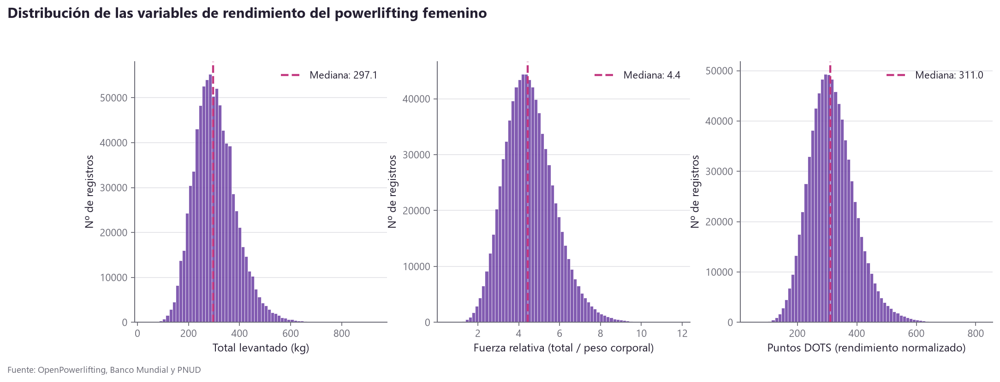

*Figura 1. Distribución de las variables de rendimiento. Las tres presentan asimetría positiva, lo que justifica el uso de la mediana y de pruebas no paramétricas en el resto del análisis.*

---

## 3. Metodología de limpieza

De los 1.120.543 registros femeninos se conservan 825.296, un 73,7%. Cada descarte
queda registrado en `registro_limpieza.csv`.

Los pasos con más impacto son cuatro. El filtro de modalidad completa descarta un
20,1% de las filas, porque comparar un total de powerlifting completo con uno de
solo press de banca no tiene sentido analítico. La exigencia de marca válida en los
tres movimientos elimina un 7,2%: en este formato un valor negativo significa
intento fallado y no una marca, de modo que tratarlo como número produciría totales
absurdos. El filtro de competición sancionada descarta un 0,2% y garantiza arbitraje
oficial. Los rangos de plausibilidad eliminan un 0,4% por peso corporal fuera del
intervalo de 30 a 250 kg o fuerza relativa fisiológicamente imposible.

Merece mención aparte el paso que verifica la coherencia del total, comprobando que
coincide con la suma de los tres levantamientos con una tolerancia de 2,5 kg por el
redondeo de los discos. No descarta ninguna fila, lo que confirma la coherencia
interna de la fuente.

### Dos decisiones que requieren explicación

La edad no se usa como criterio de filtrado. Falta en el 38% de los registros, y
eliminar esas filas destruiría gran parte del histórico. Se conservan con edad nula,
se anulan las 553 edades imposibles (fuera del rango de 10 a 90 años) sin eliminar
la fila, y los análisis por edad emplean el subconjunto con dato, que son 474.759
registros, un 57,5% del total.

Los indicadores socioeconómicos se propagan. El Banco Mundial y el PNUD publican
con retraso, de modo que sus series llegan hasta 2022-2024 y arrancan en 1990,
mientras que las competiciones cubren de 1975 a 2026: sin tratamiento, el 39% de los
registros quedaba sin contexto. Se propaga el último valor conocido dentro de cada
país, decisión defendible porque el IDH, el GII y el PIB per cápita son series muy
inerciales. Cada fila imputada queda marcada en la columna `indicadores_imputados`,
y los análisis de P3 excluyen las imputadas.

### Variables construidas

Se añaden 45 variables: temporales, geográficas, de rendimiento (fuerza relativa,
reparto entre movimientos, ratios), de ejecución técnica (tasa de acierto sobre los
nueve intentos) y longitudinales de trayectoria (número de competición, marca
anterior, mejor marca previa, mejora y récord personal).

---

## 4. P1. El crecimiento de la participación

### Volumen

En 2000 competían 1.410 atletas únicas. En 2017 la cifra era de 26.605, con 51.949
participaciones, y en 2025 alcanzó 42.411 atletas y 80.953 participaciones. El
crecimiento total es de 30,1 veces en 25 años, equivalente a una tasa anual
compuesta del 14,59%.

### Cuota femenina

La cuota pasó del 17,3% en 2000 al 36,0% en 2025, con una tendencia lineal de 0,969
puntos porcentuales al año (R²=0,689; p=1,6×10⁻⁷). En Estados Unidos, que tiene la
serie más densa, alcanza el 42,9% en 2026.

Conviene precisar cómo se calcula esta cuota, porque el método condiciona el
resultado. Se obtiene como el total de mujeres dividido entre el total de
participantes de cada año, sobre el agregado original. No se promedia la columna
`pct_participacion_femenina` a lo largo de las filas del conjunto final, porque cada
fila representa una participación femenina y ese promedio sobreponderaría los
países-año donde ya compiten muchas mujeres, sesgando la cifra al alza. Tampoco se
usa la media simple entre países, ya que las competiciones exclusivamente femeninas
alcanzan el 100% y distorsionan el promedio con independencia de su tamaño.

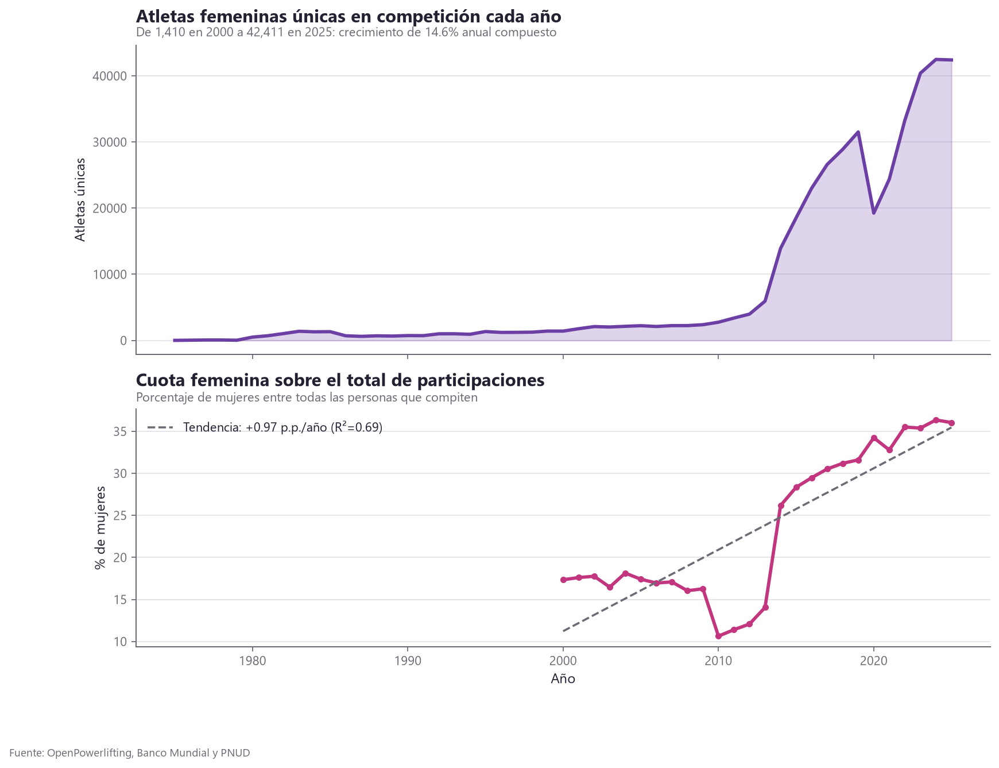

*Figura 2. Evolución de la participación femenina. El panel superior muestra el volumen de atletas únicas; el inferior, la cuota femenina sobre el total de participaciones, que es el indicador robusto frente a los cambios de cobertura de la fuente.*

### Distribución geográfica

| Región | Atletas únicas | DOTS mediano | Cuota femenina |
|---|---|---|---|
| América del Norte | 149.090 | 300,0 | 36,2% |
| Europa | 54.962 | 338,6 | 27,4% |
| Asia | 12.344 | 327,8 | 29,1% |
| Oceanía | 10.418 | 331,8 | 36,4% |
| América Latina y Caribe | 6.384 | 347,7 | 30,6% |
| África | 2.406 | 347,4 | 34,2% |

Aquí aparece el condicionante principal del proyecto: Estados Unidos concentra cerca
del 68% de los registros, y los cinco primeros países reúnen el 69,5% de las
atletas. Cualquier estadística "mundial" calculada sin más es, en realidad, una
estadística sobre Estados Unidos.

El tratamiento adoptado consiste en mantener dos niveles de lectura a lo largo de
todo el trabajo. El nivel global emplea todos los datos advirtiendo del predominio
estadounidense. El nivel comparado se restringe a los países con volumen suficiente
y es el único válido para afirmar algo sobre diferencias entre países, por lo que es
el que se usa en P3. El dashboard incorpora un filtro para alternar entre ambos.

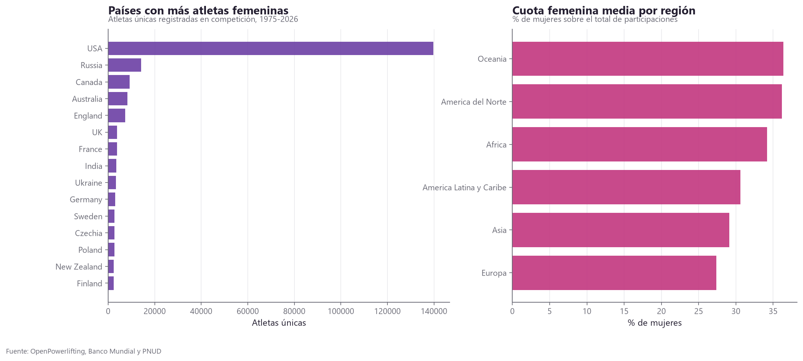

*Figura 3. Distribución geográfica. A la izquierda, los países con más atletas, donde se aprecia la magnitud de la concentración estadounidense; a la derecha, la cuota femenina media por región.*

---

## 5. P2. Qué determina el rendimiento

### Escalado con el peso corporal

Se ajusta una ley alométrica de la forma `Total = a · Peso^b`. El exponente
resultante es de **0,485**, con un intervalo de confianza al 95% muy estrecho
(0,483 a 0,488) y claramente inferior a 1. Esto implica retornos decrecientes:
duplicar el peso corporal multiplica el total por 1,4 veces, no por 2.

Conviene interpretar bien el R² de este ajuste, que es de solo **0,18**. Significa
que el peso corporal explica apenas el 18% de la variabilidad del total levantado,
lo cual no contradice el hallazgo sino que lo delimita. El exponente está estimado
con enorme precisión, porque hay 825.296 observaciones, y describe con fiabilidad
la relación media entre peso y fuerza. Pero entre dos atletas del mismo peso las
marcas varían enormemente según su entrenamiento y su experiencia, y eso es
justamente lo que el modelo predictivo confirma más adelante: la trayectoria
personal pesa mucho más que la biología.

El resultado coincide con la explicación fisiológica habitual, según la cual la
fuerza depende de la sección transversal del músculo, que escala en dos dimensiones,
mientras la masa escala en tres. La coherencia entre el dato empírico y la teoría
refuerza la confianza en los datos.

De ello se deriva que las categorías de peso ligeras son las más eficientes en
fuerza relativa, y esa es precisamente la razón de existir de índices como DOTS o
Wilks.

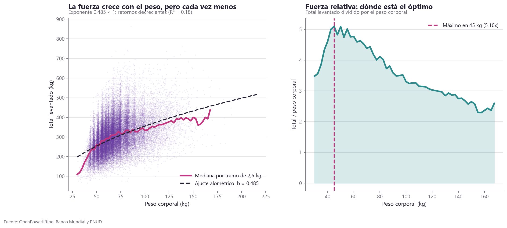

*Figura 4. Relación entre peso corporal y fuerza. El ajuste alométrico de la izquierda da un exponente de 0,485, por debajo de 1, lo que indica retornos decrecientes. La dispersión de la nube de puntos refleja el R² de 0,18: el peso marca la tendencia, pero no determina la marca individual. A la derecha, la fuerza relativa por tramo de peso.*

### Edad

El pico de rendimiento se sitúa en los 24 años, con una meseta de alto rendimiento
entre los 22 y los 28, definida como el intervalo que conserva al menos el 98% del
máximo. El descenso posterior es gradual.

| Grupo de edad | DOTS mediano | Porcentaje de podios |
|---|---|---|
| Sub-18 | 299,2 | 75,3% |
| 18-23 (júnior) | 342,7 | 76,3% |
| 24-30 | 349,4 | 78,5% |
| 31-40 | 340,2 | 82,1% |
| 41-50 | 326,0 | 88,2% |
| 51-60 | 298,6 | 89,3% |
| 60 o más | 254,6 | 92,4% |

Hay un detalle contraintuitivo en esa tabla: el porcentaje de podios aumenta con la
edad, justo cuando el rendimiento baja. No es una contradicción. En las categorías
de veteranas hay muchas menos participantes, de modo que acabar entre las tres
primeras resulta mecánicamente más probable. El podio mide competencia relativa y no
nivel absoluto.

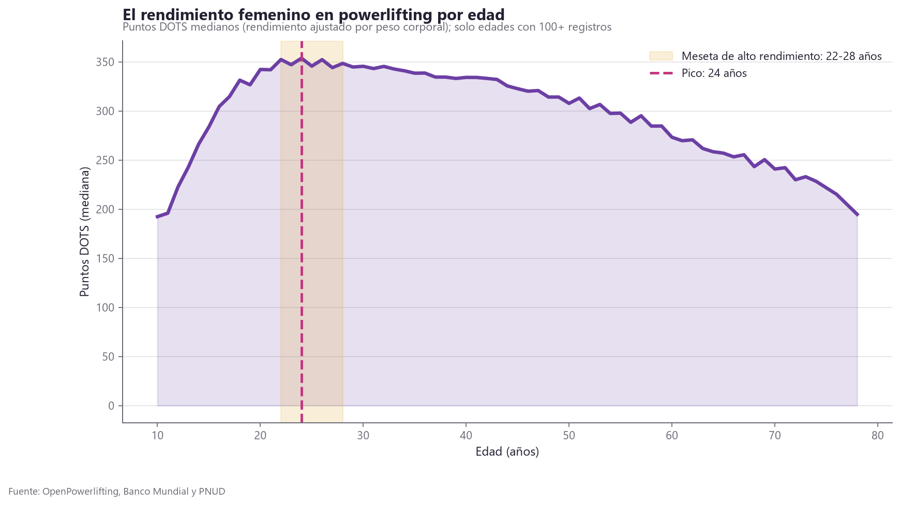

*Figura 5. Rendimiento por edad, medido en puntos DOTS medianos. La franja sombreada marca la meseta de alto rendimiento, entre los 22 y los 28 años.*

### Reparto entre los tres movimientos

El peso muerto aporta el 42,35% del total, con desviación típica de 3,83; la
sentadilla el 37,36%, con 3,49; y el press de banca el 20,29%, con 2,78. Se trata,
por tanto, de una estructura notablemente estable.

En cuanto a los arquetipos de fuerza, la prueba chi-cuadrado entre perfil dominante
y llegar al podio resulta significativa (p<0,001), pero con una V de Cramer de
0,084, lo que indica una asociación prácticamente nula.

Este caso ilustra bien por qué conviene informar del tamaño del efecto junto al
p-valor: con 825.000 filas casi cualquier contraste resulta significativo, y
"significativo pero irrelevante" es un resultado frecuente en muestras grandes.

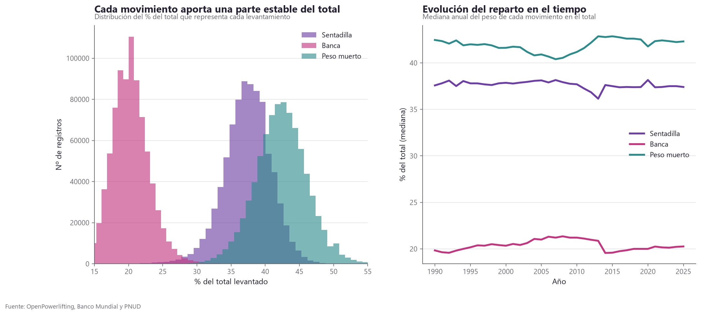

*Figura 6. Reparto del total entre los tres movimientos. A la izquierda, la distribución de la contribución de cada levantamiento; a la derecha, su evolución temporal, que muestra la estabilidad de la estructura.*

### Trayectoria y progresión

| Número de competición | DOTS mediano | Mejora mediana |
|---|---|---|
| 1 | 277,1 | n/d |
| 2 | 294,9 | +15,9 kg |
| 5 | 325,6 | +7,5 kg |
| 10 | 353,5 | +4,5 kg |

El rendimiento mejora con la experiencia, pero la ganancia se agota: la correlación
de Spearman entre número de competición y mejora es de −0,233 (p<0,001).

El dato con más implicación práctica es otro: el 40,3% de las atletas compite una
sola vez, y solo el 8,1% llega a diez competiciones o más. Para una federación, esto
sitúa el reto en la retención y no en la captación.

Hay que matizar que parte de la mejora aparente es sesgo de supervivencia, porque
quienes siguen compitiendo son, en promedio, las que mejor resultado obtuvieron
antes.

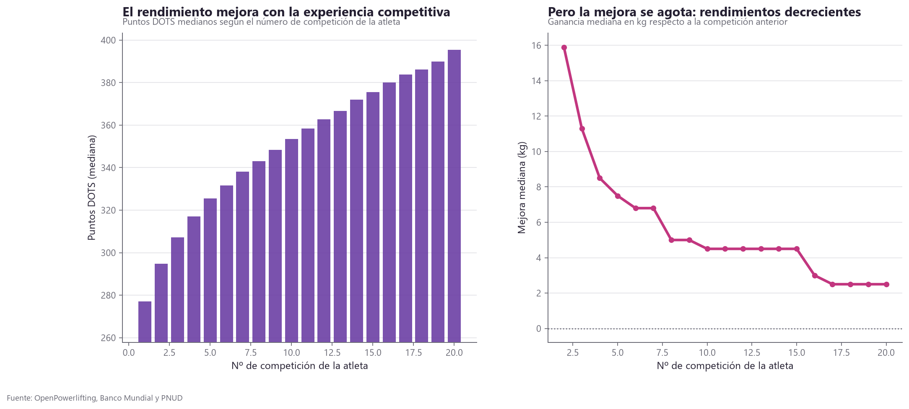

*Figura 7. Progresión a lo largo de la trayectoria. El rendimiento mejora con la experiencia (izquierda), pero la ganancia entre competiciones consecutivas se agota (derecha).*

### Brecha respecto a los hombres

La elección de la métrica resulta determinante aquí, y permitió evitar un error
grave. Los índices DOTS y Wilks aplican coeficientes distintos a hombres y mujeres,
precisamente para permitir comparaciones dentro de cada sexo. Usarlos entre sexos
arroja un ratio superior al 100%, es decir, la conclusión absurda de que las mujeres
levantan más.

Con la métrica válida, la fuerza relativa (total dividido por peso corporal, sin
ajuste por sexo), las mujeres se sitúan en el 77,2% del rendimiento masculino en
1990 y en el 73,3% en 2025. Ambas cifras son coherentes con la literatura
fisiológica.

La brecha no se estrecha, sino que se amplía ligeramente (−0,174 puntos porcentuales
al año; p=0,004). Una hipótesis plausible es que, al masificarse la participación
femenina, entra mucha más gente principiante y eso baja la mediana. No sería que la
élite retroceda, sino que la base se ensancha.

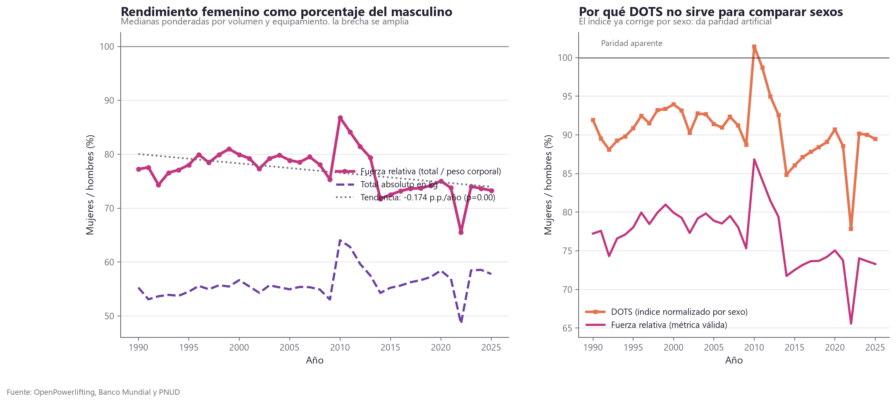

*Figura 8. Rendimiento femenino como porcentaje del masculino. El panel derecho ilustra por qué el índice DOTS no sirve para comparar sexos: al estar normalizado por sexo, produce una paridad artificial por encima del 100%.*

---

## 6. Tres sesgos que invertían las conclusiones

Esta sección recoge la aportación metodológica del trabajo. En los tres casos, el
análisis directo daba un resultado que no se sostenía.

### 6.1 El equipamiento

El análisis directo mostraba que las modalidades con equipamiento tienen un DOTS
mediano un 5,3% inferior, de donde se seguiría que el material perjudica. La
conclusión es físicamente imposible, porque el material elástico acumula energía y
ayuda a levantar más.

El diagnóstico apunta a un sesgo de composición. El tipo de equipamiento no se
asigna al azar, sino que va ligado a la federación, y las federaciones difieren
enormemente en nivel competitivo. La modalidad sin restricciones predomina en
circuitos amateur, lo que arrastra su mediana hacia abajo.

La solución fue una comparación pareada intra-atleta: se toman las 14.051 atletas
que han competido en ambas modalidades y se compara cada una consigo misma, lo que
elimina de raíz las diferencias de nivel entre personas. El resultado pasa de −5,3%
en la comparación directa entre grupos a +9,1% en la pareada (Wilcoxon, p<0,001).

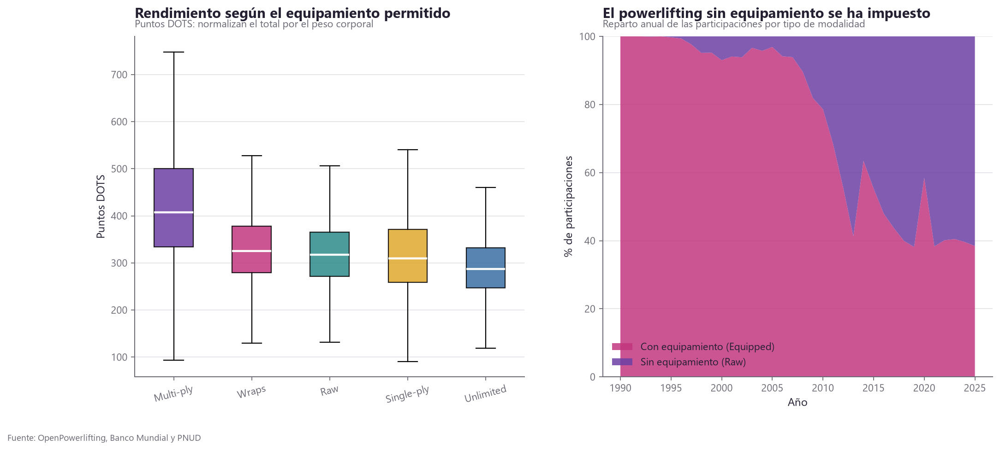

*Figura 9. Efecto del equipamiento. La comparación entre modalidades (izquierda) está contaminada por el nivel competitivo de cada federación; a la derecha, la evolución del reparto entre modalidades a lo largo del tiempo.*

### 6.2 El contexto social

El análisis directo daba correlaciones débiles y contradictorias. El GII salía
positivo en Pearson y negativo en Spearman, ninguno con magnitud apreciable, y el
grupo de países de alta desigualdad mostraba la mayor cuota femenina, justo lo
contrario de lo esperado.

Había dos problemas simultáneos. El primero es que el año actúa como variable de
confusión: la cuota femenina crece en todos los países, unos 0,9 puntos por año, y a
la vez el desarrollo humano sube y la desigualdad baja, de modo que correlacionar
directamente mezcla dos efectos distintos y puede invertir el signo. El segundo es
el sesgo de Estados Unidos: con el 68% de los registros, la correlación global
refleja la trayectoria interna de un país y no la comparación entre países.

Se abordó con correlación parcial, residualizando ambas variables respecto al año, y
con un corte transversal que toma un valor medio por país en el periodo 2015-2022,
eliminando así la dimensión temporal, restringido además a los países con 200
registros o más.

### 6.3 La brecha de género

Como ya se ha expuesto en la sección 5, DOTS y Wilks están normalizados por sexo y
por tanto no sirven para comparaciones intersexo. Se sustituyeron por la fuerza
relativa.

---

## 7. P3. El contexto social del país

La unidad de análisis es el país-año, no la atleta, con un mínimo de 40 registros y
únicamente indicadores observados. Para la lectura válida entre países se emplea el
corte transversal de 2015 a 2022 sobre países con 200 registros o más, lo que deja
una muestra de 47 países.

| Indicador | r | p | Conclusión |
|---|---|---|---|
| Índice de Desigualdad de Género | −0,087 | 0,562 | No significativa |
| Índice de Desarrollo Humano | +0,248 | 0,092 | No significativa |
| PIB per cápita (PPA) | +0,354 | 0,015 | Significativa |
| Matriculación superior femenina | +0,127 | 0,395 | No significativa |

La hipótesis inicial queda rechazada: la igualdad de género de un país, medida por
el GII, no predice la participación femenina en powerlifting.

Lo que sí la predice es la renta, con una explicación material convincente.
Competir exige cuota de gimnasio, material, licencias federativas, desplazamientos a
competiciones y, sobre todo, tiempo libre. La barrera es económica antes que
cultural.

Esta reformulación resulta más útil que la hipótesis original, porque sugiere que
para ampliar la participación femenina importan más las políticas de accesibilidad
económica que las campañas de concienciación.

Hay que ser prudente con la magnitud: con 47 países, una correlación de 0,354
explica alrededor del 12% de la varianza. Es una señal real pero moderada, y queda
mucho que estos indicadores no capturan, como la cultura deportiva nacional, la
antigüedad de la federación o la existencia de un circuito local.

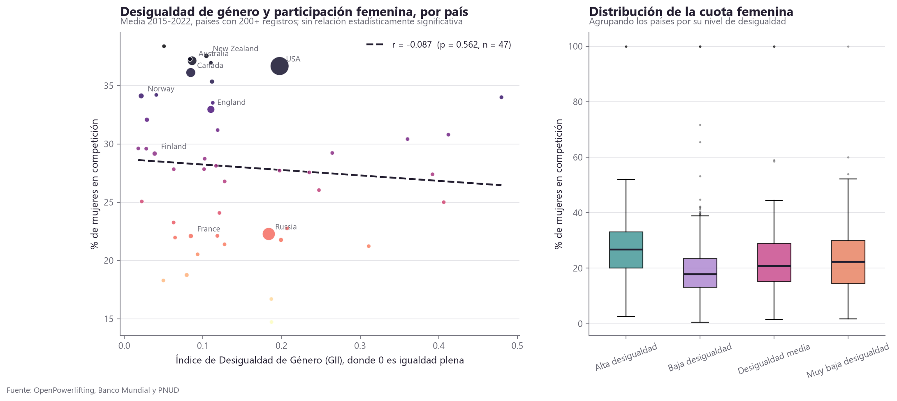

*Figura 10. Desigualdad de género y participación femenina. Cada punto de la izquierda es un país en el corte transversal 2015-2022, con el tamaño proporcional al volumen de registros; a la derecha, la distribución de la cuota femenina por nivel de desigualdad.*

---

## 8. P4. Modelo predictivo del rendimiento

### Diseño del experimento

Se emplea validación temporal y no aleatoria. El entrenamiento usa datos hasta 2022,
con 519.818 filas, y la prueba abarca de 2023 a 2026, con 305.478. Un reparto
aleatorio dejaría filas de la misma atleta a ambos lados del corte, y el modelo
acertaría por reconocerla en lugar de por haber aprendido algo.

El control de fuga de datos es estricto. Se excluyen por diseño 36 variables: los
tres levantamientos, cuya suma es el objetivo, y todas sus derivadas; los índices
calculados sobre el total, como DOTS, Wilks o la fuerza relativa; las variables que
usan el total del propio evento; y todo lo medido durante la competición que se
quiere predecir. La exclusión se comprueba mediante una asersión en el código.

### Resultados

| Modelo | MAE | RMSE | R² | Error relativo |
|---|---|---|---|---|
| Base (predecir la media) | 64,67 kg | 82,28 kg | −0,007 | 22,96% |
| Regresión lineal (Ridge) | 52,16 kg | 67,53 kg | 0,322 | 17,96% |
| Gradient boosting, solo perfil | 42,53 kg | 54,65 kg | 0,556 | 14,92% |
| Gradient boosting, perfil e historial | 15,61 kg | 24,55 kg | 0,911 | 5,27% |

Los dos últimos modelos se comparan sobre las mismas 232.409 filas, las que tienen
historial disponible, de modo que la mejora es atribuible al modelo y no a un
conjunto de prueba distinto. Conocer la trayectoria reduce el error un 63,5%.

El R² de −0,007 del modelo base confirma que el problema no es trivial. Que el
gradient boosting supere con claridad al modelo lineal indica la presencia de
relaciones no lineales e interacciones, lo que resulta coherente con la ley
alométrica descrita en P2.

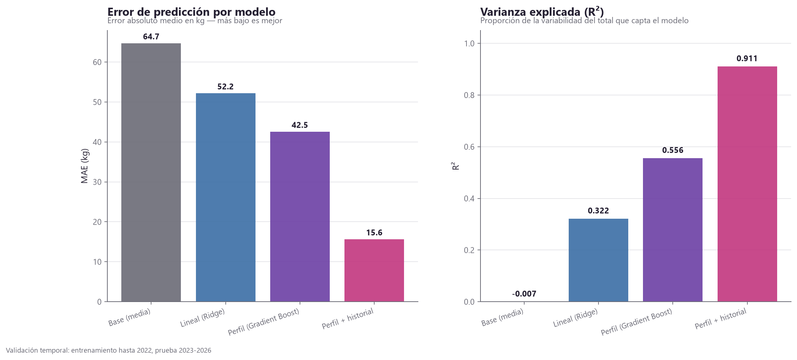

*Figura 11. Comparación de los cuatro modelos, con validación temporal. A la izquierda el error absoluto medio y a la derecha la varianza explicada.*

### Qué determina el rendimiento

Se usa importancia por permutación, preferible a la importancia interna del árbol
porque esta última se sesga hacia las variables de alta cardinalidad, como el país,
que tiene 114 categorías.

| Variable | Porcentaje de la importancia |
|---|---|
| Total en la competición anterior | 66,8% |
| Mejor total previo | 15,3% |
| Peso corporal | 4,0% |
| Edad | 3,4% |
| Equipamiento | 2,9% |
| Días desde la competición anterior | 2,8% |
| Número de competición | 2,4% |
| País | 0,2% |
| Actividad laboral femenina | 0,0% |
| IDH del país | 0,0% |

El rendimiento resulta, por tanto, fundamentalmente inercial: el historial personal
explica más del 80% de la capacidad predictiva. Y el contexto del país es
irrelevante para el rendimiento individual.

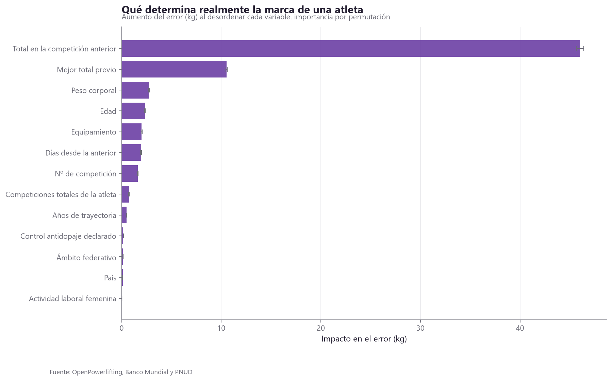

*Figura 12. Importancia de variables por permutación, medida como el aumento del error al desordenar cada variable. Los indicadores del país aparecen al final, con un efecto prácticamente nulo.*

### Diagnóstico del modelo

El residuo medio es de 0,85 kg sobre marcas de unos 300 kg, lo que indica ausencia
de sesgo sistemático apreciable. El 75,4% de las predicciones caen dentro de un
margen de 20 kg.

El error, sin embargo, no es uniforme. Analizado por tramos aparece un patrón de
regresión a la media:

| Tramo | MAE | Sesgo |
|---|---|---|
| Menos de 200 kg | 21,9 kg | +18,2 (predice de más) |
| 200-300 kg | 13,9 kg | +4,7 |
| 300-400 kg | 14,2 kg | −3,7 |
| 400-500 kg | 19,1 kg | −12,0 |
| Más de 500 kg | 31,5 kg | −24,3 (predice de menos) |

El modelo comprime los extremos: sobreestima a las atletas más débiles y subestima a
las de élite. Es un comportamiento esperable en modelos que minimizan el error
cuadrático, dado que los extremos están poco representados.

La implicación práctica es que el modelo resulta fiable en el rango de 200 a 400 kg,
donde se encuentra la mayoría de las atletas, pero debe usarse con cautela para
predecir marcas de élite, que es justamente donde una federación tendría más
interés.

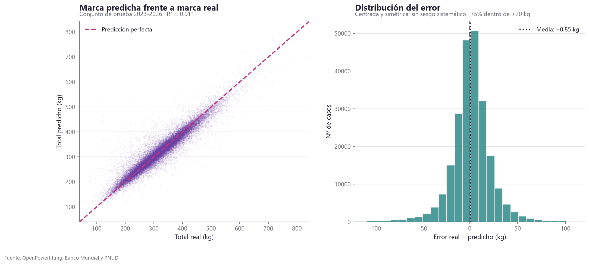

*Figura 13. Diagnóstico del modelo. A la izquierda, marca predicha frente a marca real; a la derecha, la distribución del error, centrada y simétrica.*

---

## 9. Conclusiones

El powerlifting femenino crece y gana peso relativo dentro del deporte, con un
aumento de 30 veces en atletas entre 2000 y 2025 y una cuota que pasa del 25% al
37% con tendencia sólida.

La igualdad de género del país no explica la participación femenina, mientras que la
renta sí lo hace de forma moderada. El acceso al deporte parece limitado por
recursos económicos más que por factores culturales medibles con estos índices.

El rendimiento individual es inercial y no depende del país: la trayectoria previa
explica más del 80% de la capacidad predictiva y el contexto nacional
prácticamente nada.

De la combinación de ambos resultados se sigue la conclusión central del trabajo: el
contexto económico determina quién llega a competir, no cuánto levanta quien ya
compite. El contexto es filtro de entrada y no techo de rendimiento.

La retención, y no la captación, es el problema del deporte: el 40% de las atletas
compite una sola vez.

Como aportación metodológica, en tres análisis el control del sesgo cambió o
invirtió la conclusión. El caso del equipamiento, que pasa de −5,3% a +9,1%, muestra
por qué en datos observacionales la comparación bruta entre grupos puede resultar
engañosa.

---

### Correlaciones entre las variables del estudio

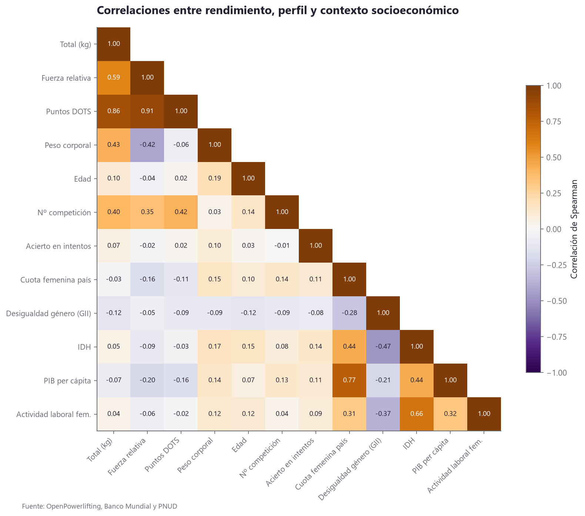

*Figura 14. Matriz de correlaciones de Spearman entre rendimiento, perfil y contexto socioeconómico. Destaca que la cuota de participación femenina del país correlaciona mucho más con el PIB per cápita (0,77) que con el índice de desigualdad de género (−0,28), lo que anticipa el resultado de P3.*

---

## 10. Limitaciones

El sesgo geográfico es severo, con Estados Unidos representando cerca del 68% de los
registros. Se gestiona mediante los dos niveles de lectura, pero condiciona toda
conclusión de alcance global.

Existe además un sesgo de cobertura en la propia fuente. OpenPowerlifting recopila
lo que las federaciones publican, de modo que es previsible que infrarrepresente a
los países sin digitalización o con federaciones jóvenes, que suelen coincidir con
los de renta baja. Esto podría afectar precisamente al hallazgo de P3.

No hay datos de entrenamiento. Volumen, intensidad, años entrenando o lesiones no
constan en la fuente, y probablemente explicarían buena parte del 9% de varianza que
el modelo no captura.

La edad falta en el 42% de los registros del conjunto final.

Los indicadores están propagados en el 38,7% de las filas. Los análisis de P3 los
excluyen, pero el dashboard los utiliza para no perder cobertura.

Todo el análisis es observacional, de modo que habla de correlación y no de
causalidad. Que el peso corporal resulte importante no implica que ganar peso mejore
la marca de forma proporcional.

El modelo solo predice a quien tiene historial: en los debuts, que son el 24% de los
registros, el error se triplica.

Por último, cabe la posibilidad de que el GII no sea la métrica adecuada para esta
pregunta. Mide salud reproductiva, empoderamiento político y participación laboral,
dimensiones que quizá no capturen las normas culturales sobre mujeres y deportes de
fuerza. Un índice específico de participación deportiva femenina podría arrojar otro
resultado.

---

## 11. Reproducibilidad

```bash
pip install -r requirements.txt

python src/extraccion.py        # descarga las tres fuentes
python src/transformacion.py    # limpieza, variables y unión
python src/analisis.py          # análisis estadístico y figuras
python src/modelos.py           # modelos y explicabilidad
python src/base_datos.py        # base SQLite con esquema en estrella
python src/consultas.py         # consultas analíticas
python src/exportar_powerbi.py  # tablas para el dashboard
```

El recorrido paso a paso está en los seis notebooks de `notebooks/`, uno por fase y
por pregunta de análisis.

Sobre el entorno, cabe advertir que en equipos con antivirus o proxy que inspecciona
TLS las descargas HTTPS desde Python fallan con `CERTIFICATE_VERIFY_FAILED`. El
paquete `truststore`, incluido en `requirements.txt`, lo resuelve delegando la
validación al almacén de certificados del sistema operativo. Instalar `certifi` no
sirve, porque el problema es una autoridad certificadora local y no una CA pública
ausente.

---

## Fuentes

OpenPowerlifting, https://www.openpowerlifting.org. Datos contribuidos al dominio
público. Volcado del 15 de agosto de 2026.

Banco Mundial, World Development Indicators, https://data.worldbank.org

PNUD, Human Development Report 2023-24, https://hdr.undp.org
